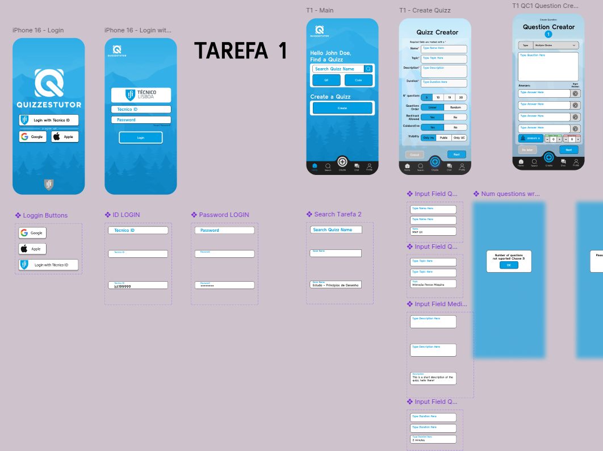
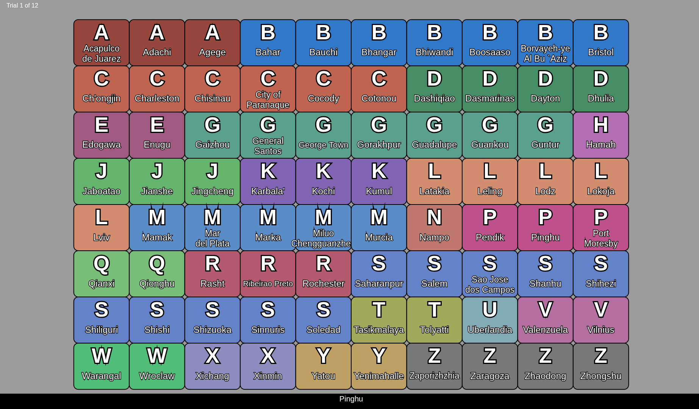

# 🎨 IPM: Human-Computer Interaction
> **User-Centered Design & Usability Evaluation**
> **Grade:** 19.5 / 20 (Top Class Distinction) 🏆

This repository hosts the high-fidelity prototypes and source code developed for the Human-Computer Interaction course. The projects focused on the **Iterative Design Process**, moving from low-fidelity paper prototypes to fully interactive applications, validated through rigorous **User Testing** and **Statistical Analysis**.

> **🌟 Achievement:** Project 1 achieved 19/20 and Project 2 achieved the maximum grade (20/20) in the "Bake-off" competitions, where the evaluation was based on anonymous user performance metrics (Time on Task, Error Rate) and Usability Questionnaires (UEQ-S).

---

## 🌍 Language / Língua
* [English Version](#-project-overview-en)
* [Versão Portuguesa](#-resumo-dos-projetos-pt)

---

## 🇬🇧 Project Overview (EN)

### 📱 Project 1: Educational App Redesign (Figma)
**Goal:** Redesign the mobile interface of "Quizzes-Tutor", an academic assessment tool.
* **Methodology:**
    * **Heuristic Evaluation:** Analyzed the original app to identify usability violations.
    * **Prototyping:** Created Paper Prototypes (Low-Fi) followed by interactive Figma Prototypes (Hi-Fi).
    * **Evaluation:** Conducted "Wizard of Oz" tests and refined the UI based on user feedback.
* **Outcome:** A fluid, accessible mobile experience for creating collaborative quizzes.
* **Tools:** Figma, UEQ-S (User Experience Questionnaire).

> 

### 🎯 Project 2: Selection in Dense Interfaces (p5.js)
**Goal:** Minimize target selection time in a dense grid (80 targets), optimizing for Fitts' Law.
* **Challenge:** Create a web interface where users could select random targets as fast as possible without errors.
* **Solution:** Implemented a visual guidance system using **Pre-attentive Attributes** (color popping and spatial highlighting) to guide the user's eye instantly to the target.
* **Evaluation:**
    * **A/B Testing:** Compared different visual strategies.
    * **Statistical Analysis:** Used T-Tests to prove the new design was significantly faster than the baseline.
* **Tech Stack:** JavaScript, p5.js, Firebase (for telemetry).

> 

---

## 🇵🇹 Resumo dos Projetos (PT)

### 📱 Projeto 1: Redesign de App Educativa (Figma)
**Objetivo:** Redesenhar a interface móvel do "Quizzes-Tutor", uma ferramenta de avaliação académica.
* **Metodologia:**
    * **Avaliação Heurística:** Análise da app original para detetar violações de usabilidade.
    * **Prototipagem:** Criação de Protótipos de Baixa Fidelidade (Papel) evoluindo para Alta Fidelidade (Figma).
    * **Avaliação:** Testes "Wizard of Oz" e refinamento iterativo com base no feedback real.
* **Resultado:** Uma experiência móvel fluida para a criação de quizzes colaborativos e assistidos por IA.
* **Ferramentas:** Figma, Questionários UEQ-S.

> 

### 🎯 Projeto 2: Seleção em Interfaces Densas (p5.js)
**Objetivo:** Minimizar o tempo de seleção de alvos numa grelha densa (80 alvos), otimizando para a Lei de Fitts.
* **Desafio:** Criar uma interface web onde utilizadores pudessem selecionar alvos aleatórios o mais rápido possível sem erros.
* **Solução:** Implementação de um sistema de **Atributos Pré-atencionais** (destaque por cor e guias espaciais) para guiar o olho do utilizador instantaneamente.
* **Avaliação:**
    * **Testes A/B:** Comparação de diferentes estratégias visuais.
    * **Análise Estatística:** Uso de Testes T para provar que o novo design era estatisticamente superior à base.
* **Tech Stack:** JavaScript, p5.js, Firebase (telemetria).

> 

---

### 👨‍💻 Authors / Autores
* **Michael Maycock**
* **Pedro Ideias**
* **Bernardo Lopes**
* **Diogo Fernandes**